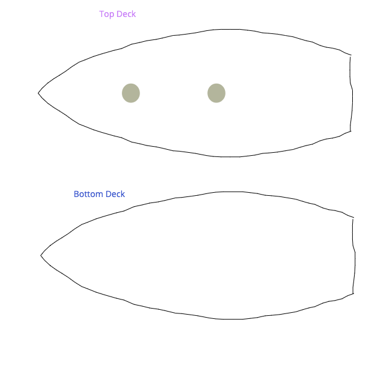
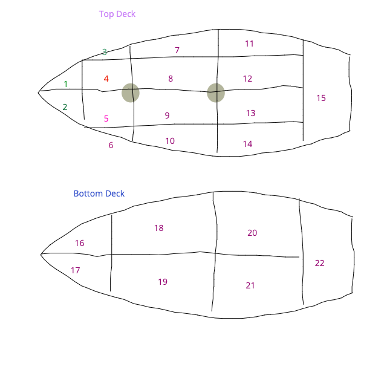
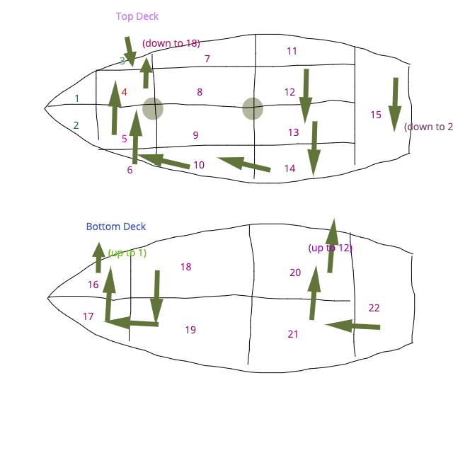
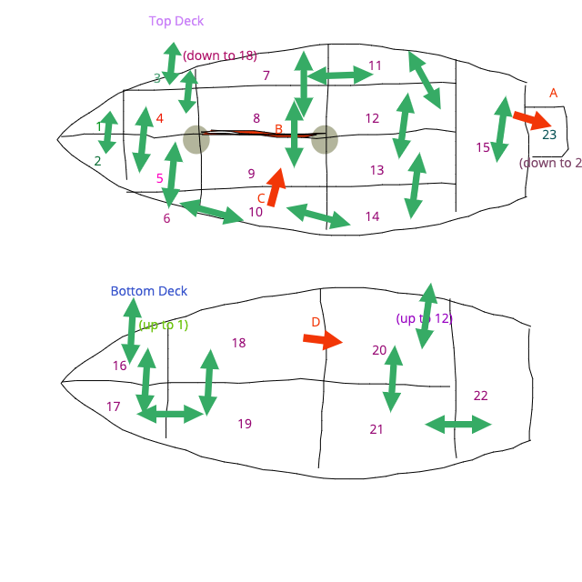

# Write Your Own Adventure Game

## Intent
This and all attendant documents are primarily intended for fun. They are designed in such a way as to be broken down into a number of weeks so as to be easily run as a coding club in a school or similar situation. This is not the only way they could be used and there is no hard and fast need to stick to the weeks. Copyright and all other rights remain with the author, this document may not be distributed, used or re-purposed in any way other than by express permission of the author.

The intent is not to teach people how to program; by the end the programmers may well be able to program, but that is a by-product. The intent is also not to teach good programming practice; by the end the programmers may well have identified some good practice, but they may well pick up some of the bad habits, shortcuts, and non-pythonic ways of doing things that the author has developed over 30+ years of programming. The intent – and this really cannot be repeated enough – is to have fun!

## System Requirements
This experience is designed to require minimal software requirements and to be as system-agnostic as possible.

Therefore, the minimum requirement is to have a working copy of Python 3 installed. The exemplar software is developed and tested on version 3.7.1. This is available on Mac, Windows and Linux. The software will also work, with minor amendments, using an online system such as repl.it which currently uses Python 3.7.4.

An IDE is needed if using a system other than repl.it. The author uses a range of IDEs and recommends programmers find one that suits them. Print screens will be provided in IDLE on a Mac. This is not the author’s recommended IDE but a base-case which should be available to all.

An Internet connection is a good idea. As this workbook progresses, students may find themselves making minor mistakes which can have large ramifications. It is always a good idea to work through these problems, debug the code, and fix it yourself. However, in the interest of this being a fun project, it is possible at the start of each ‘week’ to start with a fresh set of code as if you had completed up to the end of the previous week perfectly. This will be made available online. Note though, it is always always always recommended to modify, fiddle with, dare we say it ‘hack’ the code to make it your own. Particularly if you are developing your own adventure. In this situation if you revert to the author’s clean code you will lose all you own modifications!

## Week One: An Introduction
If you grew up in the 1970s and 1980s or happen to have read “Ready Player One”, you may have heard of the games “Adventure” and “Zork”. These two genre-leading games have a really simple concept:
- They are text based.
- You enter instructions to move around and/or solve problems.
- When you have solved the correct problem(s) in the correct way, you win.

These games are not the latest Call of Duty, GTA, or other mega-title. And the graphics make Minecraft look like it is in 4k. Because they don’t have graphics. What they do have is playability; in the same way as reading a book can be more enjoyable than watching the movie, letting your imagination run free to decide how a game should look can be more enjoyable than bowing down to the design choices of Rockstar North or Activision.

During this course you will design and make one of these adventure games. In fact, it would be particularly great if you could make two. You will be taken through step-by-step making a very simple one, but why not design your own at the same time?

The steps we will follow – which may or may not be the right way of doing things (in fact they probably aren’t!) will be as follows:
- Come up with a general concept for the game
- Design a game map
- Design routes through the game map
- Program the game map
- Design a player
- Program the player
- Designs some objects to be in the game
- Code some objects to be in the game
- Design some puzzles
- Code some puzzles

This is a version of agile development; rather than designing the program to death before starting anything we will design just enough, program it, try it out, and then design the next bit. While in some cases this can lead to disastrous outcomes with programs that don’t work properly, we are in the business of having fun and this gets you playing quickly! Do note though that this will not be a linear thing. We may need to go back and redesign things as we go through so as to keep things moving forward.

### Coming up with a general concept
Adventure – whose full name is Colossal Cave Adventure – is based in a cave system filled with wealth. Zork is set in dungeons in a great underground adventure, with the objective of getting through the dungeons alive, with all the treasures, and having solved the puzzles. Haunted House, which inspired this project, was based in (surprise surprise) a haunted house, with the objective to get back to the exit having collected all of the objects around the house.

The point is, the concept of the game is up to you. You can be as specific or as vague, as realistic or as fantastical as you like.

What about this example we’re going to supply you with? Good point! Like all sensible grown-ups, the author likes pirates! So here’s the back-story:

> Ahoy me hearties! Avast! You were sailin’ along yonder sea when a foul plague took upon yer ship-mates and one by one they fell into the sleepin’ sickness. Ye can’t sail the ship alone so ye need to drop the anchor before ye run ashore on the reef. Ye need to get to the foredeck to drop the anchor, but the ship, she is in a mess!

You don’t need a back story. I could have just said ‘You’re on a pirate ship and you need to get to the room where the anchor is to drop it.’ But where’s the fun in that?

### Designing a Game Map
The fact is that the map is the single most important part of your game. Traditionally text adventure games were split into areas you could walk between using direction commands. In the early basic games such as Haunted House these were often organised in a square grid to make the programming easier and more efficient. We can skip some of these rules if we want to although in the spirit of things, we will keep fairly close to the originals.

You will want paper and a pencil for this. Preferably a **big** bit of paper.

So, the exemplar;
-	Firstly I had to come up with a decision. I’ve decided I’m on a pirate ship, so I made the decision to have two decks.
-	So I drew a ship with two decks. You can make these as fancy or as basic as you like – the design will never be seen in the game but you might give a map to your users.



I split the two ship decks into sections that linked together and gave each one a name. The name isn’t essential, but it helps us know what we are talking about and can be the basis of the descriptions when we start programming the rooms.



Each room has a name (I number them on the picture for clarity - this will form the room ID number later on):
1. Starboard Bows
2. Port Bows
3. Starboard Forebeam
4. Starboard Foredeck
5. Port Foredeck
6. Port Forebeam
7. Starboard Beam
8. Starboard Midships
9. Port Midships
10. Port Beam
11. Starboard Quarter
12. Starboard Aft Deck
13. Port Aft Deck
14. Port Quarter
15. Poop Deck
16. Starboard Forecastle
17. Port Forecastle
18. Starboard Fore Hold
19. Port Fore Hold
20. Starboard Aft Hold
21. Port Aft Hold
22. Captain's Cabin
(No doubt a shippy-person will be along soon to tell me I got this all wrong - but it doesn't really matter!)

Feel free to change things as you go along. I've changed this about five times just in writing!

I plotted a route I wanted the player to have to take to get to the end point. This is because I want my game to end by the player getting from the Poop Deck to the anchor (in the Starbord Bows) and dropping it into the sea. If my intent was to have them collect every object or gain a set amount of points, I would have to adjust this step to ensure they can get everywhere needed. This is not to say they won’t have to visit other routes on the way – I just wanted to make sure that they would be able to get where they needed.



I added extra pathways between rooms. These are paths which may lead to dead ends, lead the player in circles, or whatever. It’s what makes the game explorable rather than just following a set map. I used single headed arrows for one-way routes and double-headed arrows where the player can move in both directions. I also added double heads on to the routes I planned earlier. At this point you may even start thinking about some puzzles the player may need to solve and add notes on to the map while you’re at it. I’ve added a trap that will cause the player to fall into the sea and added a secret room to make this happen. You don’t need to be exhaustive – it’s an iterative process!



- A: Is a one-way climb down to the rudder (room 23). If the player climbs down, they then slip, fall in the sea, and the game is over.
- B: Is a wall which can be knocked over (probably by something we find). This will enable the player to enter a series of rooms which ends up back at room 11.
- C: is a one-way exit to room 9, which means they *have* to solve the problem of the wall in B.
- D: is a one-way exit that just means the player has to go around in circles.

If you are just following the examples, have a good look at the maps and make sure you understand it. If you are creating your own adventure game as well, go ahead and design your own map. That should take you to the end of this session!

## Week 2: Programming the Game Map
We need to start programming now. I know, it’s early days in the game design world, but we need to have some **fun**.

What’s first? Well, a little bit of housekeeping. You need a folder to keep your code in. So, go ahead and create your folder. I’m going to call mine “Drop the Hook” since it’s all about pirates and dropping the anchor.

All of our files are going to be kept inside this folder. If you are also creating your own adventure game, don’t forget to create a folder for that as well.

We are going to use a type of programming called **object-oriented programming**. In this type of programming we design ‘things’ and we call these designs classes. Each class will have its own file. A class is a collection of code which defines what one of these things will know about itself (it’s **properties**) and what one of these things can do (it’s **methods**). Remember though, these classes are just **designs**. Later on we will **instantiate** these classes into **objects** – we bring them to life! (sort of!). By the way, you’re going to get confused about objects in programming terms and objects in terms of ‘things in the game’. Sorry!

So we are designing rooms. Let’s think about rooms. What do we *know* about rooms?
-	Every room has an ID number we have given it
-	Every room has a name – a short description
-	Every room is going to want a longer description if we look around it
-	Every room is going to have some exits – so we need a list of exits
-	Every room might have some things in it – so we need a list of what it contains.

What do we need rooms to be able to do? Do note that we may need to change these a bit as we go through the development cycle so it doesn’t matter if we’re not perfect first time. Don’t tell your teacher we said this though – teachers hate agile development!
-	Get and set the short description
-	Get and set the long description
-	Get a list of exits
-	Check if an exit exists
-	Add an exit (we may break a wall down to make a new one)
-	Remove an exit (something could fall over blocking an exit)
-	Get a list of what is in the room
-	Check if something is in the room
-	Remove something from the room
-	Put something in to the room

Some of these things will happen when we first create the room object.
-	Set an ID (this will happen only once so I have only included it here)
-	Set the short description
-	Set a list of exits (even if it’s empty)
-	Set a list of what is in the room (even if it’s empty)

Based on this description, I have created a template file for the room. You can download this from our website. We've called it `ROOM.py`. We will fill this in with code as we go along.

There are comments about what is happening in the code – don’t worry if you don’t fully understand it all, remember this is about fun not about understanding everything! Most of the methods have ‘pass’ written underneath them. This is because it is a template so we don’t want to actually write all this code yet, but we want it to be there as a kind of placeholder. If you leave it empty, Python gets cross. So we write pass as a kind of ‘carry on, nothing to see here, as you were…’

Now what we need to do is have a 'game' - which will be another class - to hold all of these rooms. In fact, the game will have other things as well such as a status (games can be in play or not in play), and the rooms in a list, and it will also have to hold any items that we haven't yet put into rooms.

We will need to be able to add an item to the items list, move the item to a room or from a room to the 'holding' area. We will need to be able to add a room.

We will need to be able to check if we are in play or not, and change the play status. We have again created a template file, mainly with `pass` in the methods, called `GAME.py` for you to have a look at.

Now that we have created some classes, we can go about creating a main program. We will:
- give the program access to the game and room classes (well, the templates for now)
- create a game object
- as we have programmed *some* of the game code, we will test our game object status methods.
- we will create a room and look at the short description
- we will change the short description and then look at it again

If you want to just skip to see this done, just download the `main1.py` file from week 2. But it would be a better idea to work through it, really...

Giving the program access to the classes means using `import`commands:
```py
from GAME import Game
from ROOM import Room
```

Creating an instance is also simple:
```py
game = Game()
```
So we have called our Game object game - note the use of capitalisation to differentiate?

To test the game status, I've told `game` to show us it's status, then called `flipPlayStatus` and tol it to print it out again.

```py
print('Is the game running?')
print(game.getPlayStatus())
print('Flip it around!')
game.flipPlayStatus()
print('Is the game running now?')
print(game.getPlayStatus())
```

To create a Room, we create a new room object (not the capitalisation again?) with default information, and then ask it to output it's short description.
```py
#Create a room (we used room 1 for an example, and it currently does not
# contain anything)
room = Room(1,'Startboard Bows',None,None)
#Look at the room's short description
print(room.getShortDesc())
```

And then we can tell the room to change it's short description and output it again:
```py
#Whoops - we made a typo! Change the short description and look again
room.setShortDesc('Starboard Bows')
print(room.getShortDesc())
```

What we need to be able to do now is add rooms to the game itself. To be able to test this there is a 'helper' method in `GAME.py` which prints out all of the rooms we have added. The player won't be able to use this but it helps us!

We have created a copy of the main program called `main2.py` and removed the bits we just included for testing. We have now added the room to game and then asked game to print out the rooms:
```py
room = Room(1,'Starboard Bows',None,None)
game.addRoom(room)
```

Although we can also combine this to a single line:
```py
game.addRoom(Room(2,'Port Bows',None,None))
```

And you can just call:
```py
game.listRooms()
```
to see what rooms the game includes so far.

> Activity for you!
  Go ahead and add all of the rooms into the game. If you run out of time you can use our version at `main3.py` but typing it yourself is always a better idea.

## Week 3: Making a room more than an empty box
We need to add a bit of flavour to the rooms by adding some descriptions, adding exits, and adding some way of testing how the different rooms look.

We will start with the same `GAME.py` and `ROOM.py` files from last week, and will use the same `main` file - you can copy `Week 3/main1.py` if you need a working starting point - this is the same as our `main3.py` from `Week 2`.

Firstly, the GAME needs access to be able to add a long description to a room. `GAME` will need the room number, and the description to add, and will call the `setLongDesc` function of the relevant room. We can add this to `GAME.py`:
```py
#This will add a long description to a given room
def addRoomLongDescription(self,room,desc):
    self.rooms[room].setLongDesc(desc)
```

and while we are at it, we can edit `ROOM.py` to allow us to access the long description later on:
```py
#This will look at itself and give us back the long description
def getLongDesc(self):
    return self.longDesc #Just give back whatever the current long desc is
```
We can now call `game.addRoomLongDescription()` with the room number and the descriptions as parameters. Go ahead and put these descriptions in to your `main` file. Be creative, this is a lot of what makes these games fun. You can see ours in `Week 3/main2.py` but you'd be better off adding them in yourself!
